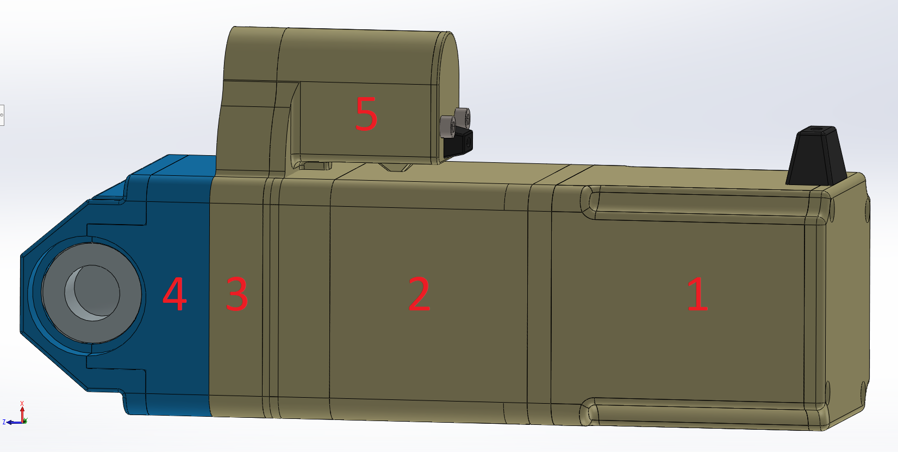
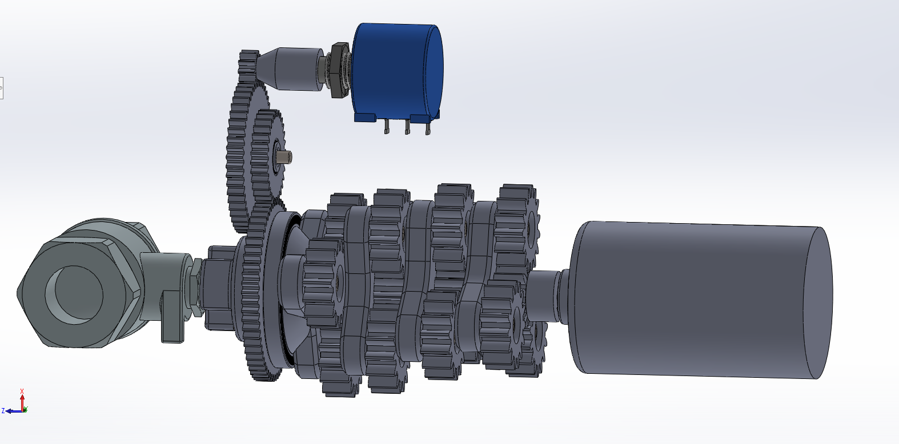

# ServoMotor (Work in progress)
This repository will present the software development process for a servomotor to control a 90 degree ball valve.

This project will have two versions. The difference will be in the method of measuring angular position. The first is shown on the 3D model on the left and is based on measuring position with a multi-turn potentiometer. The second is under design and will likely work with a magnetic encoder mounted on the back of the motor on its shaft.

<table>
  <tr>
    <th>First concept</th>
    <th>Second concept</th>
  </tr>
  <tr>
    <td align="center">
        Position measurement with multi-turn potentiometer
    </td>
    <td align="center">
        Position measurement using a magnetic encoder 
    </td>
  </tr>
  <tr>
    <th>
        <p align="center">
            
            <br />
            
        <p/>
        <p align="left">
            Description:
            <ol align="left">
                <li>12V DC motor housing (0.04N)</li>
                <li>Four-row planetary gearbox housing (625:1 ratio)</li>
                <li>Helical gearbox housing (ratio 1:10)</li>
                <li>Ball valve mount housing</li>
                <li>Multi-turn potentiometer housing (10kOhm, 10 turns)</li>
            </ol>
        <p/>
    </th>
    <th>
        <p align="center">
            
        <p/>
    </th>
  </tr>
</table>

## IDE
The IDE I use for programming is [Visual Code Studio](https://code.visualstudio.com/).
I was convinced to use it because of the large number of extensions that make work easier.
If you decide to work in VS Code I recommend installing the following extensions: 
- C/C++,
- C/C++ Extension Pack,
- C/C++ Themes,
- Corex-Debug,
- Makefile Tools.

## Build
Compiling projects from the command-line is a solution that is much more common in larger companies, and it is worth getting familiar with. It is a way of building a project that gives you a lot of opportunities to personalize the way you compile. As opposed to building a project using some IDE.

To build project we need:
- [make](https://www.gnu.org/software/make/#download)
- [GCC compiler](https://gcc.gnu.org/install/download.html)

We can compile the project in two ways.
Using the command:
``` Bash
make app
```
will compile without additional debugging information.
The second version is:
``` Bash
make debug
```
and it contains additional information that will be useful during troubleshooting.

## Flash
To flash our board we will need:
- [Open OCD](https://openocd.org/pages/getting-openocd.html)

With Open OCD we will also be able to debug our code, which is really very useful when analyzing bugs, especially with more complex projects.

Of course, the program alone is not enough and we will need a hardware part: a programmer. I will be using the ST-Link V2 programmer, as it is already built into the [Nucleo board](https://www.ebay.co.uk/p/25020387073) I am using for this project.

For more information on available commands, use the command:
``` Bash
make help
```

## Directory structure
The directory structure is based on the
[Nsumo](https://github.com/artfulbytes/nsumo_video) project.

| Directory            | Description                                                           |
|----------------------|-----------------------------------------------------------------------|
| build/               | Build output (object files + executable)                              |
| build_debug/         | Build output with debug information (object files + executable)       |
| documnets/           | Documentation (e.g., SW architecure, diagrams, images)                |
| external/            | External dependencies (as git submodules if possible)                 |
| Makefiles/           | Folder contains main makefile and compile configuration               |
| source/              | Source files (.c/.h)                                                  |
| source/app/          | Source files for the application layer (see SW architecture)          |
| source/common/       | Source files for code used across the project                         |
| source/drivers/      | Source files for the driver layer (see SW architecture)               |
| source/test/         | Source files related to test code                                     |
| .github/             | Configuration file for GitHub actions                                 |

## Schematic
  <p align="center">
      
  <p/>

## Software architecture
  <p align="center">
      
  <p/>


# More details on the project (Work in progress)
A follow-up to this README will provide a more detailed description of the project. If you want to see how I calculated and selected the gear renewal for the gearbox or how I designed the PCB then I invite you below.

## My reflections
This project is being written by me from scratch on a SMT32F3 microcontroller, as it was previously based on an Arduino and the overall approach to this project sucked. So what can I say... it did not work as it should :)

Besides, the Arduino is good for a start, and does not discourage us by overwhelming the number of individual bits that we have to configure in order to run even a blinking LED. Working with the microcontroller reference manual, and thus working on registers is much more difficult and time-consuming, but believe me that after some time it gives much more satisfaction. 

I am just learning how to work on registers, but after a few weeks it is not as hard as it seems. Although a few times my computer almost flew out the window out of frustration. But then the best thing to do is to relax, go for a walk or go fishing or ride a motorcycle or whatever to relieve your mind, and the solution will come on its own in the meantime.